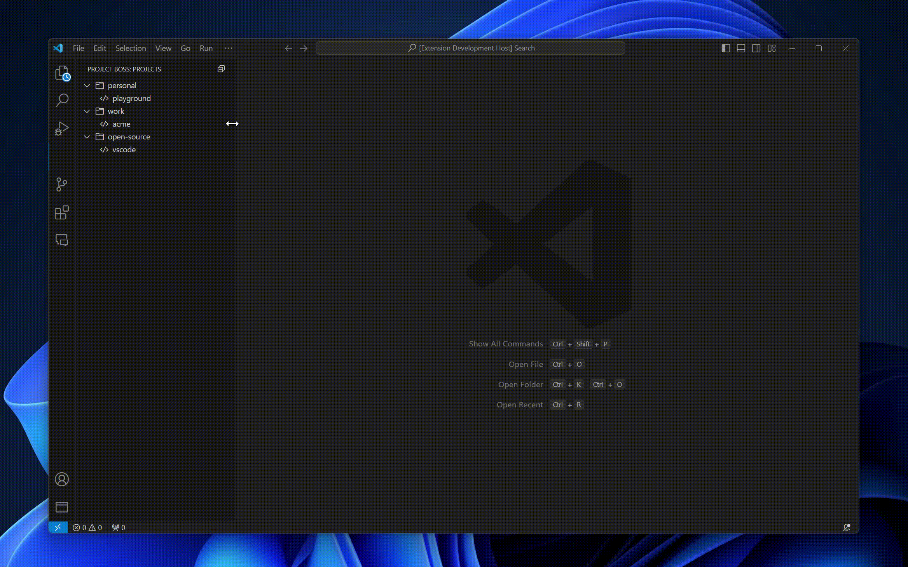

# Project Boss
Quickly switch between projects.

No setup required, but you can configure how it scans for, and opens projects in the settings.

## Features
* Quickly switch between projects using command palate or side panel.
* Open in new or current window.
* Automatically updates project list based on your settings.
* Supports opening in WSL (Windows Subsystem for Linux) distros.

## Usage


## How it works
By default, it scans your `~/projects` folder for files commonly included in development projects, such as `.git`, `package.json`, and supports nesting for better organization, take the below structure, for example.

`~/projects`
* `personal`
  * `proxy-server`
  * `website`
* `acme-mechanical`
  * `inventory`
  * `sales`
* `acme-financial`
  * `tax-returns`
  * `payroll`


> Tip: You can configure how it scans for projects in the settings.

## Extension Settings
``` json
"properties": {
    "project-boss.maxDepth": {
        "type": "integer",
        "default": 2,
        "description": "Max folder depth to scan for projects. A \"project\" is a folder that contains a .git folder or a .vscode folder."
    },
    "project-boss.projectsDirectory": {
        "type": "string",
        "default": "~/projects",
        "description": "Root directory to scan for projects, if you're using WSL, we recommend opening the path on Windows file explorer, navigating to the WSL project path and copy it from the address bar."
    },
    "project-boss.blackListRegex": {
        "type": "string",
        "default": "^(vendor|node_modules|dist|src|assets|images)$",
        "description": "Regex to exclude projects from the list. This is applied to the full path of the project."
    },
    "project-boss.projectIdentifierRegex": {
        "type": "string",
        "default": "\\.(git|package\\.json|vscode|project\\-boss)",
        "description": "Regex to identify projects. This is applied to the full path of the project."
    },
    "openProjectsInWsl": {
        "type": "boolean",
        "default": false,
        "description": "Open projects in WSL (Windows Subsystem for Linux)."
    },
    "openProjectsInWslUsingDistro": {
        "type": "string",
        "default": "Ubuntu",
        "description": "WSL distro to use when opening projects in WSL."
    },
    "wslRemotePath": {
        "type": "string",
        "default": "/home/username/projects",
        "description": "Path to the projects directory on the WSL filesystem (used when openProjectsInWsl in enabled)."
    }
}
```

## Release Notes

### 0.1.0
* Added support to open files in WSL with a specific distro 🥳
* Updated tooltip to show the relative path of the project (instead of the full path).

* Added select project in command palate and fix [issue #1](https://github.com/angus-mcritchie/project-boss/issues/1) thanks for reporting this [MartinWallgren](https://github.com/MartinWallgren).
* Added usage recording to README.

### 0.0.5
* Fixed bug where settings were locked onto using the defaults.
* Added project root directory exists error message.

### 0.0.4
* Fixed bug causing the open in new window context button displaying on other menus.

### 0.0.1
* The initial release of Project Boss.

**Enjoy!**


Made with love ❤️ by [Angus McRitchie](https://github.com/angus-mcritchie)
